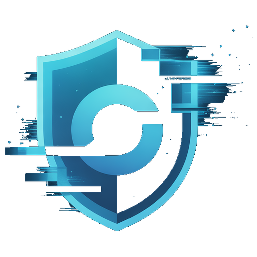
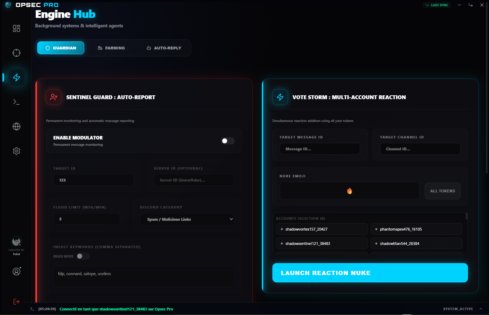
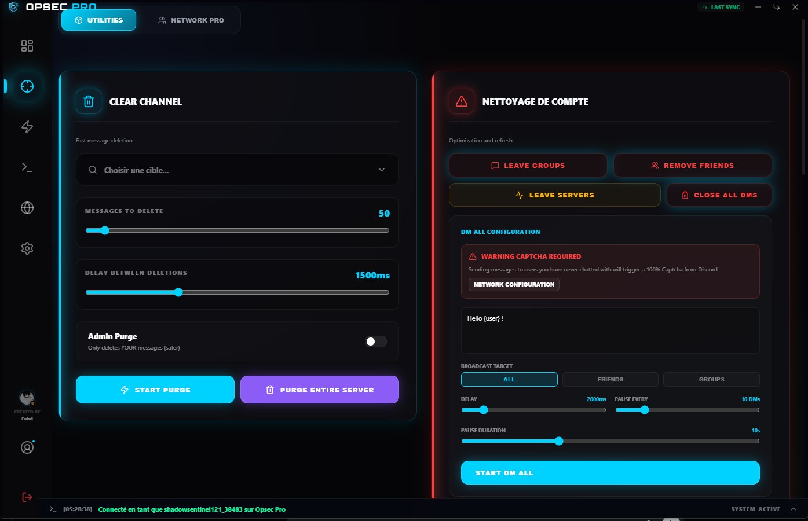
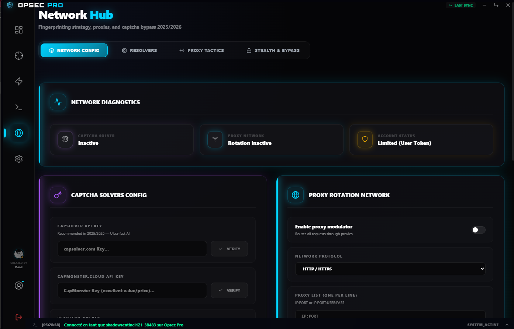
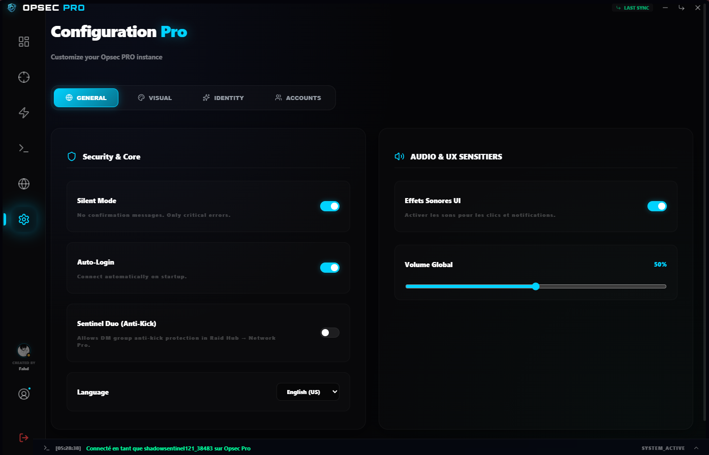
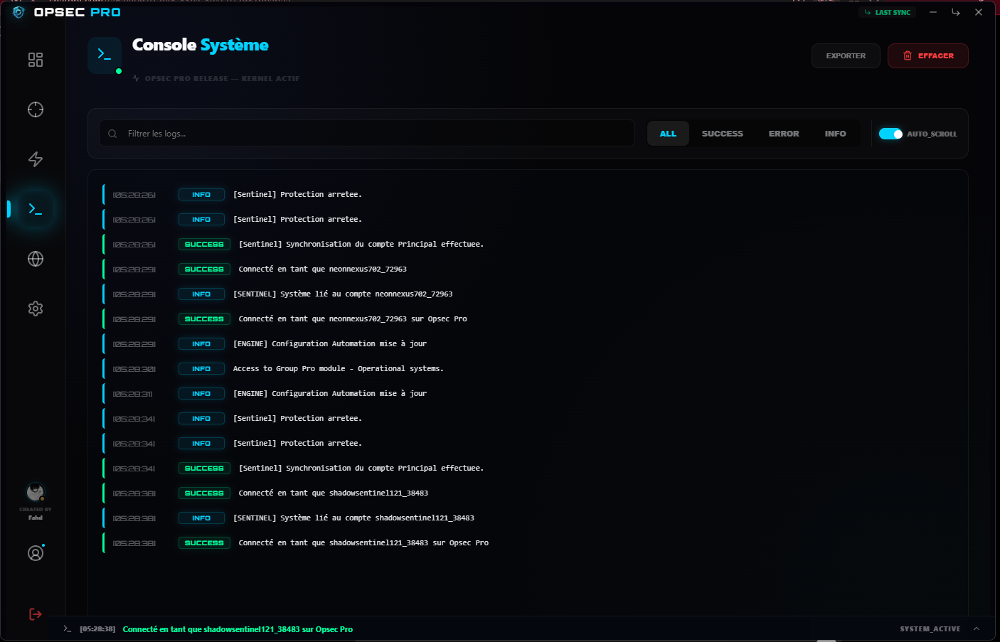

<div align="center">




# Opsec PRO

**Discord Automation Toolkit for Windows**

Built with Electron, React, TypeScript

</div>

---


---

## About

Opsec PRO is a desktop application providing Discord automation, profile management, and network utilities. It handles farming, auto-responses, account management, captcha solving, and group operations—all locally.

---

## Features

**Engine Hub**
- Profile Rotator — Automated Discord profile updates
- Message Farmer — XP farming across channels
- VC Hopper — Voice channel rotation
- Auto-Responder — Pattern-based message replies

**Raid Hub**  
- Purge Utilities — Channel/server/admin message deletion
- Pomelo Sniper — Username availability checker
- Spam System — Bulk messaging
- Spotify Sync — Profile presence updates
- Group Manager — DM group operations
- Sentinel Protection — Anti-removal safeguard

**Network Hub**
- Captcha Solvers — Capsolver, CapMonster, 2Captcha, Anti-Captcha, NoCaptchaAI
- Proxy Rotation — IP rotation via HTTP/SOCKS5
- Auto-Join — Auto server joining
- Fingerprinting — Discord detection avoidance

**Additional**
- Message Sanitizer — Batch message deletion
- Reaction Manager — Bulk reaction operations
- Voice Monitoring — Voice activity tracking
- Account Manager — Multi-account support
- App Detector — Running app detection for status

---

## Gallery

<div align="center">









</div>

---

## Tech Stack

- **Frontend** — React + TypeScript + Vite
- **Desktop** — Electron (Windows 10+)
- **Backend** — Node.js, discord.js-selfbot-v13
- **Styling** — CSS with glassmorphism effects

---

## Installation

1. Download from [Releases](https://github.com/ellecrydansmesdm/opsec-pro/releases)
2. Run `Opsec PRO Setup RELEASE.exe`
3. Launch and authenticate with Discord token

**Development**
```bash
git clone https://github.com/ellecrydansmesdm/opsec-pro.git
cd opsec-pro
npm install
npm run dev          # Dev server
npm run build        # Build
npm run dist         # Package
```

---

## Disclaimer

This application interacts with Discord using a user account token. Use of selfbot automation may violate Discord ToS. Users are responsible for compliance with platform policies and local laws.

---

## Links

- [Releases](https://github.com/ellecrydansmesdm/opsec-pro/releases)
- [Issues](https://github.com/ellecrydansmesdm/opsec-pro/issues)
