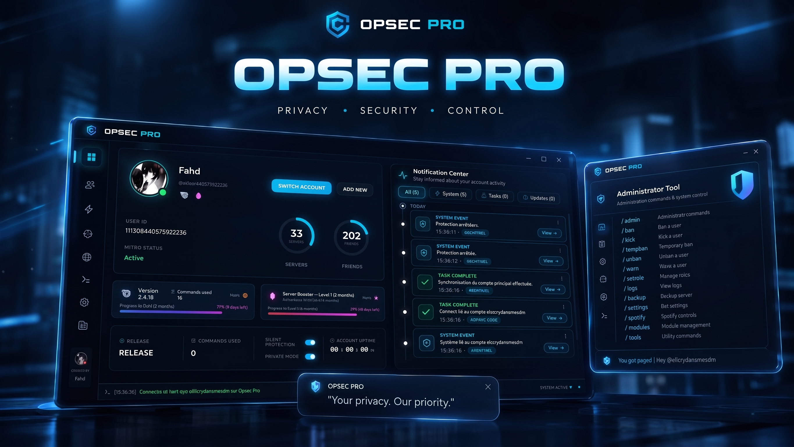

  

  

<h1 align="center">Opsec PRO</h1>

  <strong>The advanced Discord automation, security & identity orchestration suite for Windows.</strong> 
  Identity & RPC Studio • Combat & Tactical Ops • Automation Engine • Proxy & JA4 Stealth Network 
  Developed and maintained by <strong>Fahd (<a href="https://github.com/ellecrydansmesdm">@ellecrydansmesdm</a>)</strong>

  
  
  
  

  
  

> [!TIP]
> **Native Windows Desktop Architecture (v2.0)** : Opsec PRO is built natively for **Windows 10/11 (x64)** with hardware-backed Windows DPAPI encryption, atomic self-repair, and an isolated multi-session engine.  
> Unsigned community releases may trigger **Windows SmartScreen** (*« Windows a protégé votre ordinateur »*). Click **More info** (*Informations complémentaires*) → **Run anyway** (*Exécuter quand même*).

---

## About

Opsec PRO is a high-performance desktop workstation providing Discord automation, profile synchronization, tactical server interventions, and network stealth utilities. Designed with an ultra-responsive dark cyber aesthetic, it runs completely locally on your machine with strict process isolation, hardware-encrypted token storage, and zero telemetry tracking.

Every feature is modular and can be independently toggled and configured from the dedicated hub navigation bar.

Opsec PRO is developed and maintained by Fahd ([@ellecrydansmesdm](https://github.com/ellecrydansmesdm)).

---

## Features

- **Studio Hub (Identity & RPC)** — Real-time profile sequence rotator (custom status, avatar, bio, activity), rich presence editor, Spotify lyrics & playback sync, 24/7 Voice Streamer, and Discord badge emulation.
- **Engine Hub (Automation & Claimers)** — Smart pattern-matching Auto-Responder, POSIX In-Chat command dispatcher, Pomelo & Vanity claimer/sniper, automated message farming with jitter timing, and macro scenario automation.
- **Combat & Ops Hub (Tactical Defense & Messaging)** — Last Word auto-retaliation defense, Spam Pro bulk messaging, Group DM manager with Sentinel Duo anti-kick protection, Broadcast engine with pre-flight audience estimation, and dedicated Server Ops (1:1 cloner & scoped message purge).
- **Tactical Interventions** — Sentinel Guard auto-report protection and multi-account reaction storm voting.
- **Network Hub (Stealth & Proxy Routing)** — Multi-provider CAPTCHA solver integration (Capsolver, CapMonster, 2Captcha, Anti-Captcha, NoCaptchaAI), HTTP/SOCKS5 proxy rotation with live latency pings, auto-joiner, and JA4 TLS fingerprint evasion to bypass detection.
- **Vault & Security Management** — Multi-account token switcher with hardware-backed Windows DPAPI encryption, live audit logging, and Account Sanitizer for one-click emergency cache purges.

---

## Downloads & Artifacts

All binaries and release packages are published on the official [GitHub Releases](https://github.com/ellecrydansmesdm/opsec-pro/releases/latest) page:

| Platform / OS | Target Architecture | Format | Download Link | Primary Description |
| :--- | :--- | :---: | :--- | :--- |
| 🪟 **Windows** | x64 (64-bit) | `.exe` | [**Opsec-PRO-Installer.exe**](https://github.com/ellecrydansmesdm/opsec-pro/releases/latest/download/Opsec-PRO-Installer.exe) | NSIS standalone installer with atomic setup & clean uninstaller |
| 📦 **Portable Package** | x64 (64-bit) | `.zip` | [**Opsec-PRO-win-x64.zip**](https://github.com/ellecrydansmesdm/opsec-pro/releases/latest) | Standalone portable zero-install archive |
| 🛡️ **Verification** | All Releases | `.txt` | [**checksums.txt**](https://github.com/ellecrydansmesdm/opsec-pro/releases/latest) | Official SHA-256 cryptographic digest file |

> [!NOTE]
> Every release executable can be cryptographically verified against the official SHA-256 hash digests published alongside each release on GitHub.

---

## Installation

### 🪟 Windows (x64)

1. Download the latest [**Opsec-PRO-Installer.exe**](https://github.com/ellecrydansmesdm/opsec-pro/releases/latest/download/Opsec-PRO-Installer.exe).
2. Run `Opsec-PRO-Installer.exe`.
   - *If SmartScreen appears: click **More info** → **Run anyway**.*
   - *If Smart App Control (SAC on Windows 11) blocks execution: right-click `Opsec-PRO-Installer.exe` → **Properties** → check **Unblock** → **Apply**.*
3. Launch Opsec PRO and authenticate your account token into the local vault.
4. Select your active modules from the Studio, Engine, Combat, or Network hubs.

---

## Security and Privacy

Opsec PRO is engineered with strict local security boundaries and privacy-first principles:

- **Hardware-Backed Encryption**: Account tokens and proxy credentials are encrypted on your local machine using Windows DPAPI and Electron `safeStorage`. Plaintext credentials never touch disk storage unencrypted.
- **Process & Storage Isolation**: Strict Electron process boundaries (`contextIsolation: true`, `nodeIntegration: false`) with type-safe IPC validation preventing unauthorized access.
- **Zero Remote Telemetry**: Opsec PRO does not phone home, does not log external analytics, and does not send your data to any remote server.
- **JA4 TLS Fingerprint Randomization**: Spoofs browser TLS handshake signatures to blend client requests into normal desktop traffic and minimize detection flags.

---

## Support

- Join the [Official Discord Community](https://discord.gg/W2YgEStqJ4) for announcements, configuration guides, and community support.
- Report reproducible bugs and feature requests via [GitHub Issues](https://github.com/ellecrydansmesdm/opsec-pro/issues).
- When reporting issues, include your Windows build version and relevant audit log snippets. **Never share account tokens or private credentials.**

---

## Credits and License

Opsec PRO is created and maintained by **Fahd** ([@ellecrydansmesdm](https://github.com/ellecrydansmesdm)).

The project and its build metadata are released under the [MIT License](./LICENSE).

---

## Disclaimer

Opsec PRO is provided for educational and security research purposes only. Automating Discord user accounts (self-botting) violates Discord's Terms of Service and may result in account termination. Users assume full responsibility for their actions and compliance with platform terms and applicable laws. Discord is a trademark of Discord Inc.
